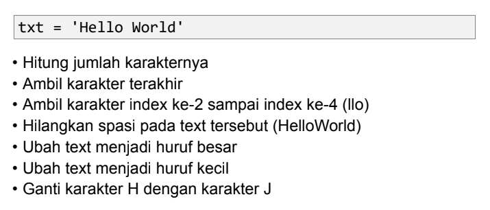
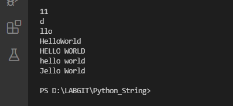
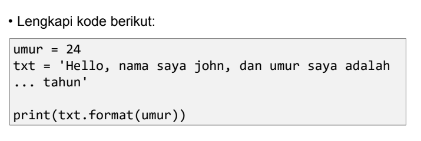
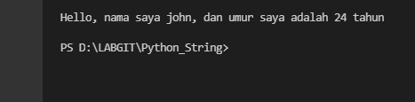

# Python_String
# Pertemuan 14
## 1. Latihan :



<li> Penjelasan </li>

1. Untuk menghitung jumlah karakter, gunakan fungsi len(). <p>

```bash
print(len(txt))
```

2. Untuk mengambil karakter terakhir, gunakan index [-1]. Sedangkan untuk mengambil karakter index ke-2 sampai ke-4, gunakan index [2:5]. <p>

```bash
print(txt[-1]) #Mengambil karakter terakhir
print(txt[2:5]) #Mengambil karakter index ke-2 sampai ke-4
```

3. Jika ingin menghilangkan spasi pada string, gunakan fungsi replace(). <p>

```bash
print(txt.replace(" ", ""))
```

4. Untuk mengubah huruf menjadi besar, gunakan fungsi upper(). Sedangkan jika ingin mengubah huruf menjadi kecil, gunakan fungsi lower(). <p>

```bash
print(txt.upper()) #Mengubah huruf menjadi besar
print(txt.lower()) #Mengubah huruf menjadi kecil
```

5. Untuk mengganti karakter ‘H’ dengan karakter ‘J’, gunakan fungsi replace(). <p>

```bash
print(txt.replace("H", "J"))
```

<li> Output </li>



## 2. Latihan :



<li> Penjelasan </li>

1. Untuk memasukkan variable ke dalam string, tambahkan kurung kurawal {} untuk menempatkan variable sebelumnya. <p>

```bash
umur = 24
txt = "\nHello, nama saya john, dan umur saya adalah {0} tahun\n"
print(txt.format(umur))
```

<li> Output </li>



## Sekian Terima Kasih